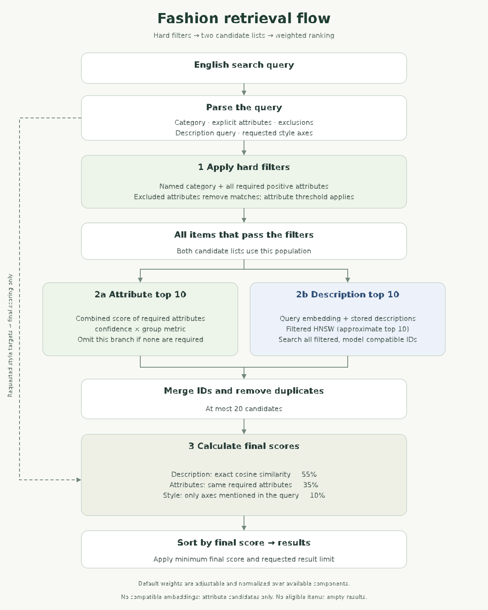

# Fashion Search

## Web experience

The web UI uses the dataset-independent name **Fashion Search**. Fashion-How is
temporary development data; the intended research demo dataset is **Fashion200K**.
Dataset names belong in experiment documentation and provenance rather than the
main interface. The initial preview displays saved images listed in `sample_ids.json`, without querying Neo4j. Search results use the same local image catalog. Catalog preview labels distinguish unranked browsing from
actual search results, without presenting a dataset as the product name.

The web UI is a retrieval workspace: query and settings at the top, followed by
extracted constraints, the final candidate query and ranked results in three adjacent panes.
Cypher stays visible without opening an accordion. Parameter values, applied
settings and measured stage timings are shown alongside the query. Image cards
include component scores; a table and item details provide more ranking evidence.
Raw parser/parameter JSON and run export remain available for inspection.
Before a search, analysis panes show empty states rather than fabricated examples.

It uses HTML, CSS and JavaScript served by FastAPI; no Node.js
or frontend build is required. The application entrypoint is `web_app.py`.

Features include responsive image cards, an optional ranking table, natural
language examples, parser/threshold controls, extracted and excluded constraints,
style-axis targets, a collapsed scoring-weight control, per-item score breakdowns
and mapped attributes, the final
candidate Cypher with redacted embedding parameters, measured stage timings, and
downloadable JSON search runs.
The initial gallery is explicitly an **unranked catalog preview**, with no invented
scores or attributes. Live results always come from the existing retrieval code.

### Run the web UI

Use Python 3.11–3.13 and Windows Command Prompt:

```cmd
python -m venv .venv
.venv\Scripts\python.exe -m pip install -r requirements.txt
.venv\Scripts\python.exe web_app.py
```

Open `http://127.0.0.1:7860`. Configure the variables below in a root `.env` file
or the server environment to enable live search. Credentials stay on the server.
The status indicator reports configuration presence, not verified connectivity.
No local GPU is required by the web retrieval path.

To view the design without installing packages or calling external services:

```cmd
python preview.py
```

This uses the same UI and local images on port 7860, with live search explicitly
disabled. Stop it with Ctrl+C before starting `web_app.py` on the same port.

### Deploy the web UI to Vercel

Import this repository into Vercel and select the **FastAPI** framework preset.
`pyproject.toml` specifies `web_app:app` as the entrypoint and lists the application
dependencies. `.vercelignore` excludes local environment files, development
artifacts and the preview server from uploads. There is no frontend build command. Set
`OPENAI_API_KEY`, `NEO4J_URI`, `NEO4J_USERNAME` and `NEO4J_PASSWORD` in the project
environment, plus any optional model/database settings listed below. Redeploy
after changing environment variables. Use a Neo4j endpoint reachable from the
deployment. API reference: `/docs`.

Static UI assets are mounted at `/assets`; `/images/{filename}` serves only saved files whose IDs are listed in `sample_ids.json`. Missing images display a placeholder.
Review the function duration available to the project before a live demo: parser
and embedding calls can take time, especially when provider retries are needed.

Vercel configuration follows the [official FastAPI deployment guide](https://vercel.com/docs/frameworks/backend/fastapi).

### Verification

```cmd
python -m unittest discover -s tests -v
```

The service tests use provider doubles to verify real Cypher generation,
reranking, thresholds, safe response fields and preview semantics without API
charges. They do not establish connectivity to a deployed database or provider.

## Environment variables

Set these in the server environment or a local `.env` file. For deployment,
register the values in the Vercel project's environment variables:

```text
OPENAI_API_KEY
NEO4J_URI
NEO4J_USERNAME
NEO4J_PASSWORD
```

Optional:

```text
NEO4J_DATABASE
OPENAI_MODEL
OPENAI_EMBEDDING_MODEL
```

## Fashion200K sample images

`sample_ids.json` lists 5,000 Fashion200K IDs across five categories. All 5,000
corresponding images are stored in `sample_images/` (about 86 MB). The application
serves these files directly; no image download or extraction script is needed.

The web app and `preview.py` read only local files in `sample_images/` whose IDs
appear in `sample_ids.json`. They make no Hugging Face image requests. Search
results without a saved image retain their ranking evidence and show an image
placeholder. Commit `sample_ids.json` and the `sample_images/` files
when preparing the deployment; check the hosting provider's file and deployment
size limits for the full collection.

## Demo Structure

```text
.
|-- web_app.py                     # FastAPI application entrypoint
|-- preview.py                     # dependency-free UI preview (local images)
|-- web/                           # HTML, CSS, JavaScript and favicon
|-- requirements.txt              # application dependencies for local install
|-- pyproject.toml                 # project dependencies and Vercel entrypoint
|-- vercel.json                    # FastAPI deployment preset
|-- tests/                         # offline service and preview tests
|-- sample_ids.json               # allowed Fashion200K image IDs
|-- sample_images/                # saved Fashion200K images
`-- src/
    `-- fashion_how_graphdb/
        |-- web_service.py         # retrieval API adapter and image catalog
        |-- search.py              # query parsing and CLI
        |-- hybrid_search.py       # vector/graph candidate union and reranking
        |-- neo4j_config.py        # Neo4j connection defaults
        |-- taxonomy.py
        |-- category_taxonomy.py
        `-- llm.py                 # text-only search query parsing
```

This demo only searches an existing Fashion-200K graph. Image attribute extraction
and graph import are handled by the separate Fashion-Retrieval project.
Search uses `(Item)-[:IS_CATEGORY]->(Category)` and the English taxonomy IDs.
The query parser identifies the category, positive and excluded graph attributes,
directly named attributes, a positive visual description, and requested
style axes. Category, required attribute and excluded attribute filters run
before candidate selection. Within the filtered items, two independent lists
are selected: the top 10 by the combined graph attribute score and the top 10 by
description similarity using filtered HNSW. Their IDs are merged and deduplicated, giving at most
20 candidates for final scoring. With no required attributes, only the description
list is used. The final result limit does not enlarge either candidate list.
Directly named positive
attributes such as "white" in "white jacket" require a matching graph edge;
the same required attributes supply graph candidates and the attribute score.
Inferred attributes stay in the parsed output but do not affect graph candidates
or the attribute score. Excluded attributes only remove matching items.
Attribute filtering and graph scoring both use `confidence * metric`: color
coverage, pattern/category prominence, or season score. Materials and attributes
without a metric use confidence alone. `min_confidence` is retained as the API/CLI
parameter name, but now thresholds this attribute match score. The web UI labels
it **Min. attribute match**. A threshold of zero leaves low-coverage matches
eligible; raise it to require stronger matches.
Final scoring combines description
similarity (55%), matching graph edges (35%), and mentioned style axes (10%);
weights are normalized across available components. Color, pattern and category
attributes carry full graph weight; materials and seasons are weaker signals.
The web settings expose description, graph-attribute, and style weights under
**Scoring weights**. Their default relative values are 55:35:10. The UI shows
the effective split as values change; each search sends its chosen weights to
the API. At least one weight must be above zero, and unavailable or zero-weight
score components are omitted before the remaining weights are normalized.

### Retrieval flow



[Download the PNG diagram](web/search-flow.png). Both branches use the entire
hard-filtered population; the description branch additionally requires a matching
embedding model. Style targets affect final scoring only.
To regenerate the SVG and PNG with matplotlib installed:

```cmd
python scripts\render_search_flow.py
```

## Neo4j Item Properties

For Fashion200K images, each `Item` should preserve the Hugging Face `item_ID`
as `id` (or supply a separate `item_ID` property). Only IDs in `sample_ids.json`
with saved image files receive an image URL.

Live search requires `Item.description_embedding` with 3,072 dimensions,
`Item.description_embedding_model` set to `text-embedding-3-large`.
The query embedding must use the same model and dimensions as stored items.
Set `OPENAI_EMBEDDING_MODEL` if the stored item vectors use another model.
Description selection uses Cypher 25 `SEARCH` against the existing online
`item_description_embedding_filtered` vector index. It must index
`description_embedding` and include `id` as an additional filter property,
with support for `WHERE item.id IN $filtered_ids` inside `SEARCH` (Neo4j 2026.06+
or a compatible Aura release). Set `NEO4J_DESCRIPTION_VECTOR_INDEX` to override
the index name. The graph query first collects all IDs that pass the hard filters
and calculates their attribute scores. HNSW then searches within eligible IDs
whose embedding model matches the query model, returning up to 10 approximate
neighbors. The full eligible ID list is not truncated to the attribute top 10.
Exact `vector.similarity.cosine` is computed only for the combined candidates
(at most 20) before final reranking. The graph filtering and ID transfer still
depend on the size of the eligible population. Search does not create indexes
or modify items; an unsupported SEARCH clause or missing index raises an error
instead of silently switching to an exhaustive vector scan.

```text
description_embedding
description_embedding_model
```

For style-axis reranking, each `Item` can include:

```text
visual_trend
thermal_impression
design_expression
minimal_maximal
casual_formal
soft_sharp
young_mature
```

Each axis value is a float from `0.0` to `1.0`, where `0.0` is the left pole and
`1.0` is the right pole.
